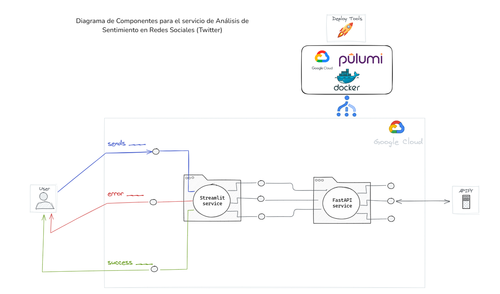

# Arquitectura del Proyecto SparkProcessNLP

Este documento describe la arquitectura y componentes principales del proyecto SparkProcessNLP, una aplicación para búsqueda y procesamiento de tweets.



## Estructura del Proyecto

```
SparkProcessNLP/
├── backend/                 # Servicio backend en FastAPI
│   ├── app/                # Código fuente del backend
│   ├── Dockerfile          # Configuración de Docker para el backend
│   └── .env               # Variables de entorno del backend
├── frontend/            # Interfaz de usuario en Streamlit
│   ├── app.py             # Aplicación principal de Streamlit
│   ├── Dockerfile         # Configuración de Docker para el frontend
│   └── .env              # Variables de entorno del frontend
└── pulumi/                # Infraestructura como código con Pulumi
    ├── index.ts           # Configuración principal de Pulumi
    ├── package.json       # Dependencias de Pulumi
    └── .env              # Variables de entorno de Pulumi
```

## Componentes Principales

### 1. Backend (FastAPI)

El backend es un servicio REST API construido con FastAPI que maneja:
- Búsqueda de tweets usando la API de Apify
- Procesamiento de datos
- Almacenamiento de resultados

**Variables de Entorno:**
- `APIFY_API_TOKEN`: Token de autenticación para la API de Apify

**Endpoints:**
- `POST /search`: Endpoint principal para búsqueda de tweets
  - Parámetros: términos de búsqueda, fechas, filtros, etc.
  - Retorna: tweets procesados en formato JSON

### 2. Frontend (Streamlit)

La interfaz de usuario está construida con Streamlit y proporciona:
- Formulario interactivo para búsqueda de tweets
- Visualización de resultados
- Filtros y opciones de búsqueda

**Variables de Entorno:**
- `BACKEND_URL`: URL del servicio backend

**Características:**
- Interfaz intuitiva y responsiva
- Visualización de datos en tablas
- Filtros dinámicos
- Manejo de errores y estados de carga

### 3. Infraestructura (Pulumi)

La infraestructura está definida como código usando Pulumi y desplegada en Google Cloud Platform:

**Componentes:**
- Google Container Registry (GCR) para almacenamiento de imágenes Docker
- Cloud Run para ejecución de servicios
- Configuración de IAM y permisos

**Variables de Entorno:**
- `apifyToken`: Token secreto de Apify (configurado en Pulumi)
- `backendUrl`: URL del servicio backend (configurado en Pulumi)
- `GCP_SERVICE_ACCOUNT_KEY`: Credenciales de GCP

## Flujo de Datos

1. El usuario interactúa con la interfaz de Streamlit
2. El frontend envía la solicitud al backend
3. El backend procesa la solicitud usando la API de Apify
4. Los resultados se envían de vuelta al frontend
5. El frontend visualiza los resultados

## Despliegue

### Requisitos Previos
- Cuenta de Google Cloud Platform
- Cuenta de Apify
- Pulumi CLI instalado
- Docker instalado

### Pasos de Despliegue

1. **Configurar Variables de Entorno en Pulumi:**
   ```bash
   pulumi config set --secret apifyToken "tu_token_de_apify"
   pulumi config set --secret backendUrl "https://tu-backend-service-url/search"
   ```

2. **Desplegar Infraestructura:**
   ```bash
   cd pulumi
   pulumi up
   ```

3. **Verificar Despliegue:**
   - Acceder a la URL del frontend proporcionada por Pulumi
   - Verificar que los servicios estén funcionando correctamente

## Seguridad

- Las variables de entorno sensibles se manejan como secretos en Pulumi
- Los servicios de Cloud Run tienen configurados los permisos IAM necesarios
- Las credenciales de GCP se manejan de forma segura
- Las imágenes Docker se almacenan en GCR

## Mantenimiento

### Actualización de Servicios
1. Modificar el código en el servicio correspondiente
2. Reconstruir la imagen Docker
3. Desplegar con `pulumi up`

### Monitoreo
- Utilizar Google Cloud Monitoring para supervisar los servicios
- Revisar logs en Cloud Logging
- Monitorear costos en Google Cloud Billing

## Consideraciones de Escalabilidad

- Cloud Run escala automáticamente según la demanda
- Los servicios están diseñados para ser stateless
- Las imágenes Docker están optimizadas para tamaño y rendimiento
- Se utiliza caching cuando es apropiado

## Solución de Problemas

### Problemas Comunes
1. **Error de Conexión al Backend:**
   - Verificar la URL del backend en las variables de entorno
   - Comprobar que el servicio esté funcionando

2. **Error de Autenticación con Apify:**
   - Verificar el token en las variables de entorno
   - Comprobar la validez del token

3. **Problemas de Despliegue:**
   - Revisar logs de Pulumi
   - Verificar permisos de GCP
   - Comprobar configuración de Docker
